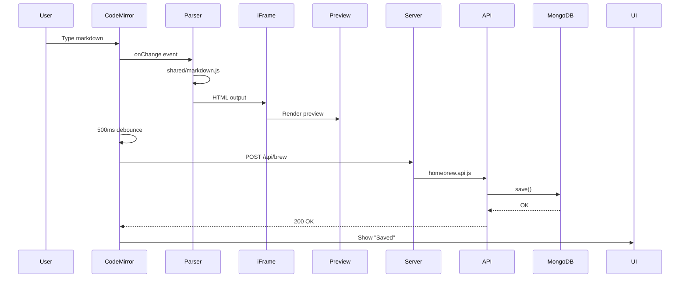

# Architecture Overview

Homebrewery is a three-layer application: React frontend with CodeMirror editor and iFrame preview, Express backend with REST API, MongoDB for persistence. Markdown parsing via Marked.js happens on both client and server, but the server never executes it with user input.

## Structure

Frontend (`/client`): React app with editor (CodeMirror), iFrame renderer for preview, navbar with actions (share, print, save), authentication UI.
Backend (`/server`): Express routes, CRUD endpoints for brews, database operations, static file serving, Google Drive integration.
Shared (`/shared`): Marked.js parser with custom extensions (tables, variables, emojis, etc). Used by both client (for preview) and server (only on Homebrewery templates, never user input).
Database: MongoDB collections for brews, users, notifications.

## Edit and Save Flow

Print flow: Click "get PDF" → Load lazy images → window.print() → User selects PDF in browser dialog.

## Key Files

`client/homebrew/navbar/print.navitem.jsx` — PDF button calling printCurrentBrew()
`client/homebrew/renderer/` — iFrame component receiving HTML
`shared/markdown.js` — All Markdown parsing (tokenizers, renderers, extensions)
`server/app.js` — Route definitions (GET /edit/:id, GET /share/:id, POST /api/brew, etc)
`server/homebrew.api.js` — Brew CRUD logic
`themes/phb/phb.less` — Main theme stylesheet (compiled to CSS)

## Technologies

Frontend: React, CodeMirror v6, Vite (build tool)
Backend: Express.js, Node.js, MongoDB
Rendering: Marked.js (Markdown→HTML), iFrame (isolation), Browser CSS engine
Styling: LESS preprocessor, CSS variables for theming, inline styles via `{{ }}` syntax

## Database

Brews: `{_id, title, text, style, shareId, editId, authors, theme, renderer, createdAt, updatedAt}`

The `text` field stores the complete markdown including metadata block. `style` stores user-defined CSS. `shareId` and `editId` are URL identifiers for public/edit links.
