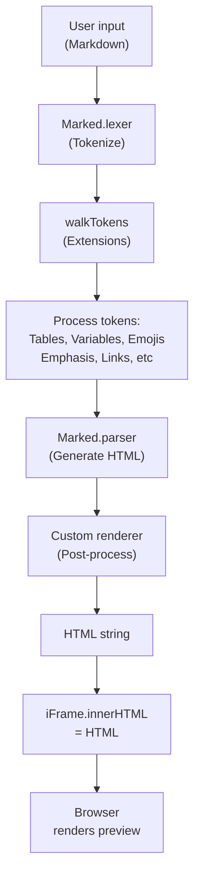
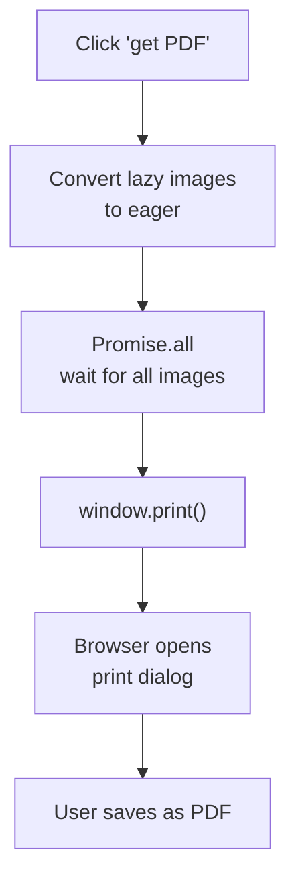

# Rendering System

Markdown is parsed and rendered entirely in the browser using Marked.js. The parser resides in `shared/markdown.js` and processes markdown through tokenization → extension processing → HTML generation → custom rendering.

## Rendering Sequence

## Marked.js Extensions

Each extension is a tokenizer (detect pattern) + renderer (output HTML) + registration.

mustacheSpans `{{ color: red; }}text{{}}` → `text`
mustacheDivs `{{ width: 50%; }}content{{/}}` → Block-level styling
Tables (marked-extended-tables) → Pipe tables with alignment support
Definition lists (marked-definition-lists) → Term: definition format
Alignment (marked-alignment-paragraphs) → Center, right-align text blocks
Variables (marked-variables) → Define and reference values
Emojis (marked-emoji) → `:sword:`, `:shield:`, etc using icon fonts
Smartypants (marked-smartypants-lite) → Smart quotes, dashes, ellipsis
Heading IDs (marked-gfm-heading-id) → Auto anchor links from h1-h6

To add a new extension: Create tokenizer that detects pattern, write renderer that outputs HTML, register with Marked.use({ extensions: [yourExtension] }), add CSS to theme. See ADDING_MARKDOWN_EXTENSIONS.md for detailed example.

## Image Lazy Loading

Images render with `loading="lazy"`. When printing, the system converts them to `loading="eager"` and waits for all to load before opening print dialog. This prevents blank images in PDFs.

CSS variable `--HB_src` exposes image URLs for CSS-based decorative effects.

## Rendering Flow for Print

## Limitations

CSS masks fail in PDF (browser limitation). Workaround: Use border-radius, box-shadow instead.
Image styling can break (transforms, filters). Workaround: Keep image CSS simple.
Large documents (5000+ lines) slow down (no virtual scrolling). Workaround: Split content, reduce images.
XSS surface exists (Issue #546, accepted trade-off for styling freedom). See DEVELOPMENT_PHILOSOPHY.md.

For philosophy on why there's no server-side rendering, see DEVELOPMENT_PHILOSOPHY.md.
